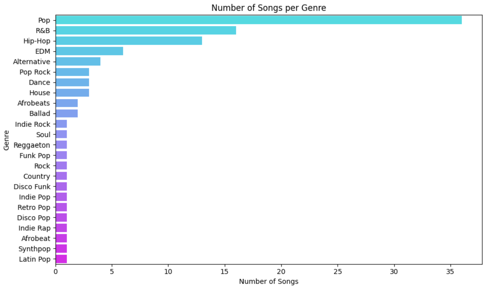
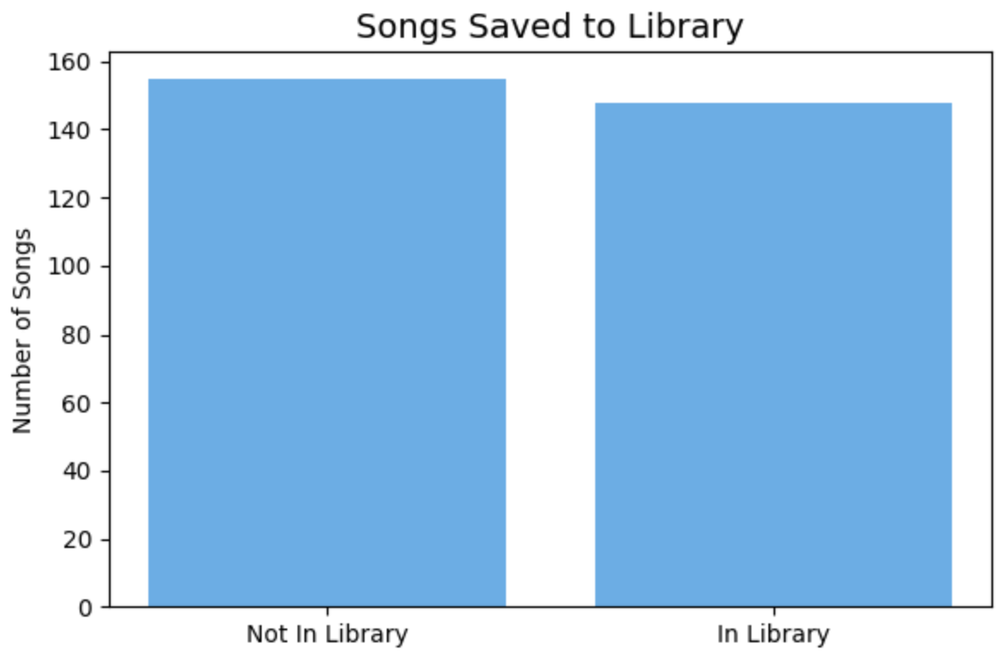
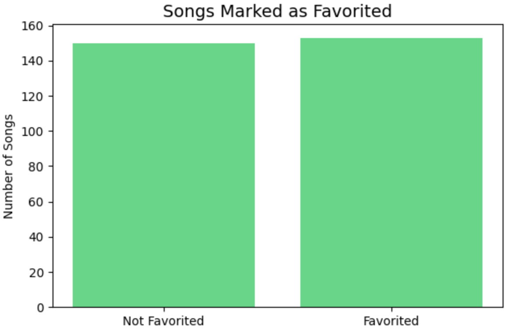

## MSBA Team 4
Andrew Linton: https://github.com/amlinton7  

Malachi Ndur: https://github.com/MalachiNdur  

Grace Schaaff: https://github.com/gschaaff  

Mauni Branch: https://github.com/ybranchy

## Project Kanban Board
Check out our progress and tasks on the [Kanban board](https://github.com/users/MSBA-Team4/projects/1). 

## Project Scope

This project focuses specifically on AI in creative industries, with a narrow focus on AI-powered recommender systems in music streaming platforms. We aim to explore how user behaviors impact the effectiveness of recommendations, and how this behavior can be modeled to enhance user experience and engagement with the platform.

## Project Details

The business problem we aim to address is increasing customer loyalty and growth. The majority of music streaming platforms are driven by a subscription model, meaning that they rely on the recurring revenue of customers' monthly or annual payments to the platform. Thus, stable revenue is dependent on loyal customers, and growing revenue is dependent on growing the customer base. 

Much of the reason for the expansion of digital music streaming in the past 10 years, as compared to CDs, iPods, etc. is the level of customizeability and recommendation that a streaming platform can offer. A key differentiator for major platforms such as Spotify and Apple Music, is the companies' abilities to procure music that is directly to the user's taste. As these companies, and their smaller competitors continue to fight for customers, building AI models that are more in-tune with a customer's preferences is a crucial competitive advantage. 

Through our project, we demonstrate the benefits of recommender systems to companies in growing subscriptions and revenue, and the value-add to consumers in bettering their music-listening experiences. 

### Overview

Art is extremely subjective. Whether you are looking at a painting, reading a book, listening to a song, or watching a movie, you may have a completely different response to it than the person sitting next to you, experiencing the same piece of work, but in an entirely different way. This subjectivity is what makes it very difficult for AI to recreate art that has the same effect as that of created by human beings. 
While AI may not be the best way to create art, it can be useful in many different ways to supplement art made by humans. Within creative industries, AI is  transforming how artists, designers, writers, and musicians work, as it has the ability to edit photos and videos, proofread writing, and even generate its own images. 

### Our Topic: AI In Music Streaming Platforms 

Another example of AI being used to supplement creativity is through recommender systems. Because all forms of art are experienced in a very personal way, it can be useful to have the art you experience, whether it be books, movies, music, or something else entirely, be personalized to your tastes. AI can enhance discovery by understanding user behavior patterns. Many streaming services, such as Netflix or Spotify, are already using AI in order to make movie or music recommendations for their users. This is why, for the purposes of our project, we have chosen to explore how recommender systems, specifically in music streaming platforms, use AI to personalize listening experiences and make recommendations. 

### Business Problem

The business problem we aim to address is increasing customer loyalty and growth through stronger, more customized recommendations. The majority of music streaming platforms are driven by a subscription model, meaning that they rely on the recurring revenue of customers' monthly or annual payments to the platform. Thus, stable revenue is dependent on loyal customers, and growing revenue is dependent on growing the customer base. 

Much of the reason for the expansion of digital music streaming in the past 10 years, as compared to CDs, iPods, etc. is the level of customizeability and recommendation that a streaming platform can offer. A key differentiator for major platforms such as Spotify and Apple Music, is the companies' abilities to procure music that is directly to the user's taste. As these companies, and their smaller competitors continue to fight for customers, building AI models that are more in-tune with a customer's preferences is a crucial competitive advantage. 

Through our project, we demonstrate the benefits of recommender systems to companies in growing subscriptions and revenue, and value-add to consumers in bettering their music-listening experiences. 

### Business Importance

Recommender systems are important for businesses in order to cater to their specific customer base overall, as well as allowing them to target multiple niche customer segments simultaneously. Personalized recommendations will improve user experience, which is always good for businesses. A user who feels the platform "gets" them is more likely to return, listen longer, and subscribe. Accurate recommendations increase  interaction with the platform and overall brand loyalty. The accuracy or quality of recommendations and personalization can even be used as a way for brands to differentiate among competitors.

Recommender systems are also very useful for platforms that rely on ad revenue, as targeted ads are more likely to lead to interactions or purchases.

Using AI for recommendations can also increase operational efficiency. The model has the ability to collect user data and make recommendations for a large scale of users in a short time. 

### Research Article: MUSE 

MUSE is an example of an advanced music recommender system that takes “shuffle play” into account. Shuffling songs puts tracks in a random order, and the user is not actively choosing to listen to that specific song, so it can hinder a typical recommender system and lead to less accurate suggestions.

Therefore, the MUSE system focuses on improving music recommendations by learning from the seemingly random shuffle play behavior. Unlike traditional systems that focus only on individual songs, MUSE models entire sequences of tracks (like how users move from one song to the next) to capture how users engage with a playlist or listening session. It also takes into account data like number of skips, replays, and total listening duration. 

The following findings are based on the MUSE research article, which explores music recommendation techniques using a subset of the Million Song Dataset and models trained to predict the second half of a user’s listening history.

- Background: Loosely based on the Million Song Dataset Kaggle competition. Model is trained on the first half of the user’s listening history and aims to predict the second half of the user’s listening history.
  - Utilized a 10,000 song subset of the data for local testing, then cloud resource to compute on the full dataset.
  - Model Features Used: Track ID, song ID, title, release year, artist name, duration, artist familiarity and hotness, danceability, energy, tempo, loudness, and song hotness.
- Goal: Determine the best methods for music recommendation with minimal user information.
- Models Utilized:
    - Logistic Regression
    - K-Nearest Neighbors
    - Item-Item Collaborative Filtering
    - Matrix Factorization
- Evaluation Metrics:
  - Recall: (Correctly predicted songs out of user’s second-half listening history / total songs in that half)
  - Precision: (Correctly predicted songs out of user’s second-half history / total number of recommended songs)
- Results:
    - Artist familiarity and song hotness are slightly correlated
    - Model’s precision decreases as the number of recommendations increases (score depends on number of recommendations)
    - Recall increases as the number of recommendations increases (score is independent of number of recommendations)
    - Nearest Neighbor and Item-Item methods scored the highest → suggests collaborative filtering is most effective
      - Item-Item performed best when only recommending 10 items ⟶ best for recommending a few highly relevant songs

## Data Exploration & Visualizations

Before building our recommendation system, we conducted a brief exploratory analysis of the dataset to better understand user behavior and song attributes.

### Key Insights:

- 🎧 Unique Users: 20
- 🎵 Unique Songs: 101
- 🎼 Unique Genres: 24

This helped us understand the scale and diversity of the music streaming data we were working with.

Here are the visualizations we created during the data exploration phase to better understand our dataset before building the recommendation system.

  

The genre distribution chart illustrates the number of songs in each genre within the dataset. It highlights the diversity of the music library and reveals whether certain genres are over- or underrepresented.

  
  

The first chart shows how many songs users have favorited versus those that remain unfavorited, providing a snapshot of user preferences across the dataset.

The second chart shows the number of songs users have added to their libraries versus those they haven’t, providing a snapshot of user preferences across the dataset.

## Demo Code: Recommender Systems
[Click here to launch the demo notebook in Colab](https://colab.research.google.com/drive/1uDB6mOqb_SkLPCkuKNFWAYupRd5mLrOT?usp=sharing)

We wanted to create a very simple model—as opposed to the more complex MUSE recommender mentioned in the research article—that gives personalized song recommendations based on individual songs and user interactions. Our goal was to recommend five songs to a user based on their listening history, while also giving them some useful metadata like the song title, genre, and whether the user has that song saved to their library or favorites.
To achieve this, we used Python and TensorFlow to build a basic retrieval-based recommendation system. We started by using GenAI to generate two synthetic datasets:
- User Ratings Dataset: user_id, song_id, song_title, song_genres, in_library, is_favorited
- Song Information Dataset: song_id, song_title, song_genres

We first converted user and song IDs into numeric values to make them compatible with TensorFlow. Then we created a TensorFlow dataset, defined a simple retrieval model using embedding layers, and trained it on user-song interaction data. Finally, we generated the top 5 personalized song recommendations for a sample user and mapped the results back to include each song’s title, genre, and whether it was in the user’s library or favorites.

This project demonstrates how even simple machine learning models, developed in Python, can be used to create meaningful, personalized experiences based on user behavior.

## Website Demo: Vibe Coding
[Click here to access the web-app interface](https://script.google.com/macros/s/AKfycbyVYWKeaGxByyANSG854Je92sPNDCKnlLPoKlAcqiXzuqBt1ecJT96OMdrxBUpLI2f6/exec)

For the website demo, we utilized the large language models Claude, ChatGPT, and Google Gemini to expand the functionality of our demo code into a Website App with a more intuitive user interface. This program works in a similar theme to our demo code, but expands on its functionality. The program receives the user's input as to preferred genre, mood, song tempo, and lyrical complexity, and recommends 5 songs based on how closely they match said inputs. The user can then rate each recommended song on a scale of 1-5, which the algorithm stores in short-term storage for the duration of that user's session. The model adapts to which matching inputs the user ranks higher, and curates the recommendations accordingly. For example, if a user consistently highly rates songs that match their preferences in genre, the model will prioritize matching the user's genre preference more highly than the song tempo preference. 

We tackled this project using ‘vibe coding’, which is a programming technique that generates advanced level code by leveraging AI’s ability to understand natural language prompts. To successfully vibe-code our web-app, we prompted various LLMs with extremely specific parameters for our project, for example: 

*You are a coder with 40 years of experience. I'd like you to create me a google app script for song recommendations. Provide an app script code file for back and and an HTML file for front end. Use text boxes to get user input. This should be very functional and clean, and does not have to be overly complicated, yet should help us to effectively demonstrate the benefits of AI recommenders to the board of our company. Please use a decently sized database of songs to allow users to get a customizable experience. Please ask me any questions you have before you generate the script. 
Let's use genre, mood, song tempo, and lyrical complexity as inputs to base recommendations on. Allow users to provide feedback to improve future recommendations. It can be a mix of genres and musical eras. I do not need links to the songs. Please show 5 to 10 recommendations at once. The interface can be simple but should be aesthetic. Please ensure that the code will be functional.*

We then input the vibe code that the LLM generated into our web-app script and began the debugging process. A few of the issues we ran into included (but were not limited to, the website not opening at all when deployed, the website opening to a blank page, the website opening with the correct user interface but with no way to interact, and finally, the website opening with a fully functional user interface but a limited song database that did not vary enough to customize to the user’s preferences. As we encountered each of these problems, we returned to the LLM with more specific prompts that allowed us to focus the code specifically on our project goal and solve each problem as we went along. We used all 3 LLMs to generate different song lists so that our database would be large enough to customize. We also manually changed the number of song recommendations from 5-10 so that each song was a better match to the user’s inputs.

## What's Next?
As we look ahead, it’s important to not only build on recent advancements in music recommendation systems, but also address ongoing challenges related to ethics, fairness, and personalization.

Future directions for AI-powered music recommendation systems include:
- Emotion-based and mood-aware recommendations: Future models may incorporate real-time emotional context to better match music to a user’s mood, enhancing personalization beyond static preferences.
- Dynamic personalization: Systems could adapt in real-time to shifting user behaviors, preferences, and environments (e.g., time of day, location, recent activity).
- Multi-modal AI integration: Combining audio signals, lyrics, metadata, and user behavior can lead to deeper insights and more refined recommendations.
- Addressing algorithmic bias and fairness: As with all AI systems, recommender models must account for potential biases that may limit exposure to diverse artists, genres, or cultures.
- Ethical concerns: Issues such as filter bubbles, data privacy, and the representation of underexposed artists need to be addressed to ensure that recommendation engines serve both users and creators fairly.

As AI continues to evolve, music recommendation systems will play an even larger role in shaping discovery and engagement. Future innovation must balance technical performance with ethical responsibility and cultural inclusivity.

  
## Responsible AI Considerations

As with any recommender system, whether social media, entertainment, or music, we risk bias in the recommendations that the model provides to users. With music specifically, users with aggressive or extreme beliefs could be recommended songs containing lyrics that motivate them to act in a harmful manner. Additionally, children could easily be recommended music with innapropriate or explicit content if not specifically marked as a children's account.

Additionally, because of this bias, users may be discouraged from discovering new artists, genres, or cultures, which limits the diversity of the listening experience. It can also hinder the exposure of emerging or underrepresented musicians, making it harder for them to break through or find their audience. While MUSE attempts to improve accuracy by considering listening behavior on shuffle play, it still risks over-relying on behavioral data that may not fully reflect user preferences or intent.

AI models like MUSE rely heavily on user interaction data, such as listening history, skip and replay behavior, or listening duration. Although having access to this data improves model accuracy, it raises some ethical concerns about user data privacy. Are users aware of what data is being collected and how it is being used? Is the data anonymized and stored securely? Can this data be sold or used for purposes outside of listening recommendations, such as ad targeting or profiling? 

## References 

Anthropic. (n.d.). Claude. https://claude.ai/

Lam, M., Lin, Z., & Bressler, D. W. (2023). MusAI: Generative Recommender Systems for Music (arXiv:2308.09649). arXiv. https://arxiv.org/abs/2308.09649

Google. (n.d.). Gemini. https://gemini.google.com/

OpenAI. (n.d.). OpenAI. https://openai.com/

<!--
**MSBA-Team4/MSBA-Team4** is a ✨ _special_ ✨ repository because its `README.md` (this file) appears on your GitHub profile.

Here are some ideas to get you started:

- 🔭 I’m currently working on ...
- 🌱 I’m currently learning ...
- 👯 I’m looking to collaborate on ...
- 🤔 I’m looking for help with ...
- 💬 Ask me about ...
- 📫 How to reach me: ...
- 😄 Pronouns: ...
- ⚡ Fun fact: ...
-->
